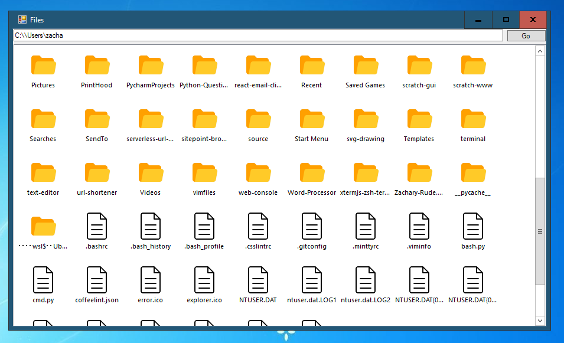
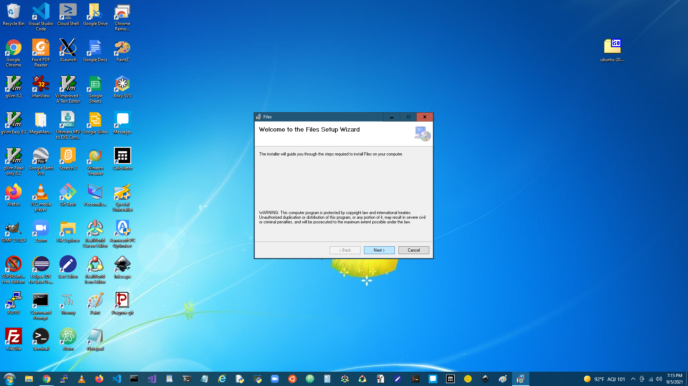
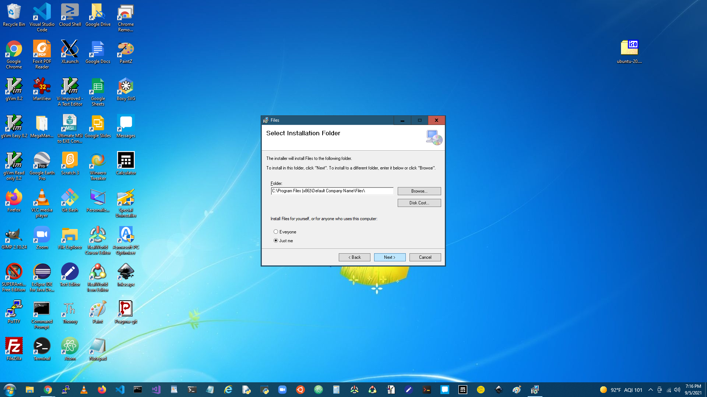

# **Files**

Files is a simple and homemade file manager app for Windows, written in Visual Basic.

## __Building from Source__

### **Requirements**

* Visual Studio 2017
+ .NET version 4.6.1
- Git

### __Build and Run__

#### **Method 1: Downloading the Code**

Go to [https://github.com/Zachary-Rude/files](https://github.com/Zachary-Rude/files/), and then click on the green "&darr; Code:" button, and then click on "Download ZIP", and then extract the "Files.sln" file.

#### __Method 2: Cloning the Repository__

Assuming that Git is installed on your computer, open the command line (Command Prompt or PowerShell) on your PC and type this command:

```
git clone https://github.com/Zachary-Rude/files
```

No matter which method you use, assuming that you have all of the prerequisites installed on your computer, double-click on the extracted "Files.sln" to open it, and then click on "&#9654; Start" to run the app.

## **Troubleshooting**

For troubleshooting on Files, go to [https://github.com/Zachary-Rude/files/issues](https://github.com/Zachary-Rude/files/issues).

## __Download and Install the App__

Go to [https://download-files.zacharyrude.repl.co/](https://download-files.zacharyrude.repl.co/), and then click on the green Download button.

After which, you'll get a file called "Files.msi". Click on it, and you might get a Windows Defender box, but just click on More info and then Run anyway. After which, you'll get the setup wizard, which will help you install Files on your computer.

Click "Next >".



Click "Next >".



Click "Next >". You'll get the UAC box, and you may have to ask your computer's main root user (admin) to enter their password.


Click "Close".


